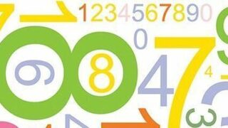
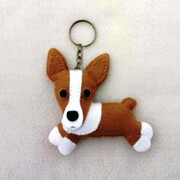
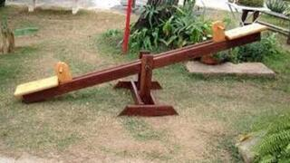

## Links
- [basic](#basic)

## basic

||
-|-|-
@000 a. Soma 2|@001 b. Miolo da lista|@002 c. Quantos iguais

||
-|-|-
@003 d. Maior de 3|@004 e. Some os ímpares|@005 f. Contar negativos

||
-|-|-
@006 g. Pedaço do Rabo|@007 h. Gangorra mal feita| 

