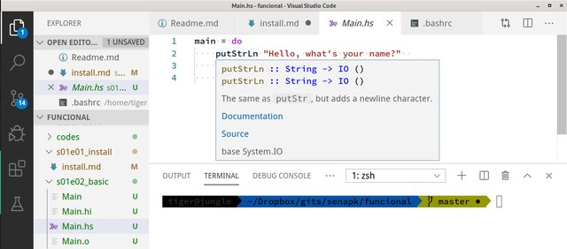

## Instalação do Haskell

## Configurando ambiente no ubuntu

```sh
## Instalar prerequisitos para ubuntu
sudo apt install libicu-dev libncurses-dev libgmp-dev git build-essential libicu-dev libtinfo-dev libgmp-dev libc6-dev libffi-dev git g++ gcc make xz-utils zlib1g-dev gnupg curl

```


## Download haskell platform for your operating system
```
# install ghcup, ghc, ghci, cabal
curl --proto '=https' --tlsv1.2 -sSf https://get-ghcup.haskell.org | sh
# responda yes quando for perguntado


## test ghc and ghci
ghc --version
ghci --version
```


## Vscode
Instalar vscode e a extensão `haskell`

Criar um código simples em haskell e testar se o funciona o autocomplete e a identificação de erros.

```hs
-- Main.hs
main = do
    putStrLn "Hello, what's your name?"  
    name <- getLine
    putStrLn ("Hey " ++ name ++ ", you rock!")
```

Compilar e executar usando

```bash
ghc -o Main Main.hs
./Main
```

Se o plugin estiver instalado, quando você abrir um arquivo .hs, o vscode vai instalar o haskell-language-server.




## O gerenciador de pacotes é o Cabal
## Para instalar o pacote split, por exemplo, utilize
```
## instalar um pacote
cabal update # vai demorar um pouco
cabal install split --lib
```

Teste o pacote split com o seguinte código no ghci

```hs
import Data.List.Split
splitOn "," "my,comma,separated,list"
```


## Função Bash para Rodar
Insira a seguinte função no final do seu .bashrc ou .zshrc

```bash
function mh {
    echo '$' ghc $1.hs -o $1.out && ghc $1.hs -o $1.out && echo "" &&
    rm *.hi *.o &&
    echo '$' ./$1.out && ./$1.out && 
    rm *.out
}
```

Se o nome do seu código fonte for `Main.hs`, basta digitar `mh Main` no terminal, 
que ele vai compilar, limpar os arquivos temporários e ao fim limpar o executável.


